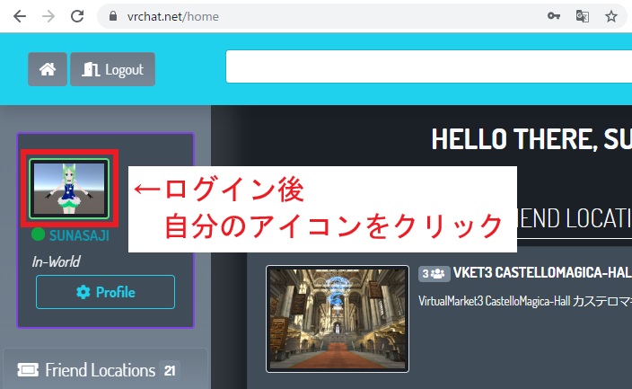
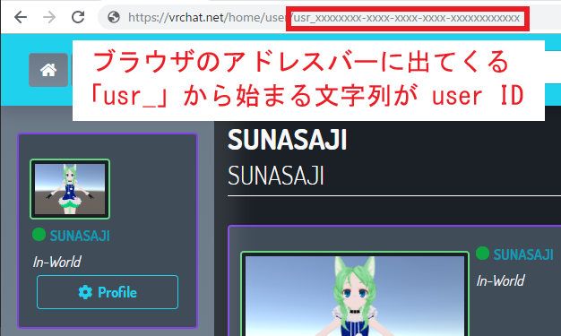
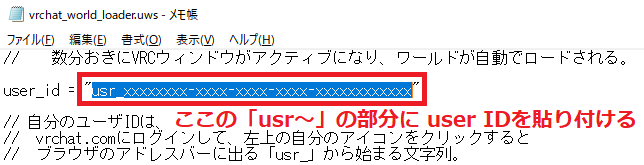

# VRChat_World_Loader
VRChatのワールドを自動でロードするUWSCスクリプト

## 概要
VRChatのワールドを自動でロードしてキャッシュしておくためのスクリプトです。ネット回線速度が遅い環境で、寝ている間や外出している間にワールドをロードさせておくと、次にジョインしたときに素早くワールドに入るために役立つかもしれません。UWSCという操作自動化ツールに読み込ませて使います。

## 使い方
1. UWSCをダウンロードしてZIPを右クリックし「すべて解凍(T)...」で解凍する。  
https://www.vector.co.jp/soft/winnt/util/se115105.html
1. VR機器をPCから外してデスクトップモードでVRChatが起動できるようにする。
2. VRChatメニューから「SETTINGS」を開き「SKIP GO BUTTON IN LOAD」にチェックを入れる。
3. vrchat.com にログインして、左上の自分のアイコンをクリックする。  
  
4. ブラウザのアドレスバーに出るUser IDを確認する。  

5. 「vrchat_world_loader.uws」をメモ帳で開き、「user_id = 」から始まる行の「usr_xxx...」の部分に、自分のユーザIDを設定して保存する。  

6. 開きたいワールドのIDが記入されたスクリプト(vket4_world_loader.uwsなど)を、UWSC.exeにドラッグ＆ドロップして放置する。数分おきにVRCウィンドウがアクティブになり、ワールドが自動でロードされる。

## Tips
- 「このvrchatを開くには新しいアプリが必要です」とメッセージが出た場合は、"C:\Program Files  (x86)\Steam\steamapps\common\VRChat" にある install.exe を実行して、チェックを入れて「Proceed」を押す。この操作により、「vrchat://」形式のリンクをVRChatで開けるようになる。
- 既に訪問したワールドなど、ロード不要のワールドは、開きたいワールドのIDが記入されたスクリプトのWorld_Openの行の前に「//」を入れるとロードをスキップできる。
- 自動ロードを止めたいときは、タスクバーに出てくるUWSCのアプリアイコンを右クリックして「ウィンドウを閉じる」を選択する。
- VRChatのウィンドウをチェックする間隔は「vrchat_world_loader.uws」の「check_interval」の秒数を調整すると変更できる。

## 注意
- ロードが完了しても、ワールドが更新された場合やワールドIDが変わった場合は再ロードが必要となる。

## ライセンス
本スクリプトのライセンスは[CC0 1.0](http://creativecommons.org/publicdomain/zero/1.0/)

## 謝辞
- Vket4向けに[@R3botan](https://twitter.com/r3botan)さんがデータを更新してくれました。ありがとうございます。
